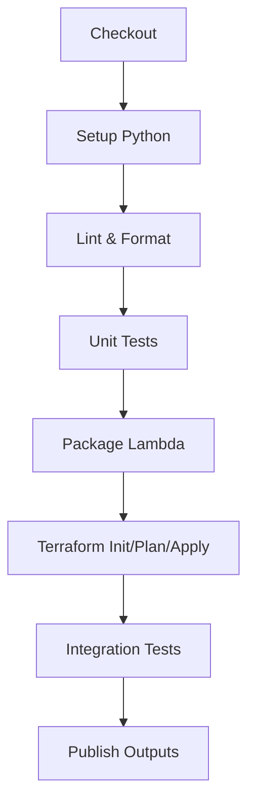
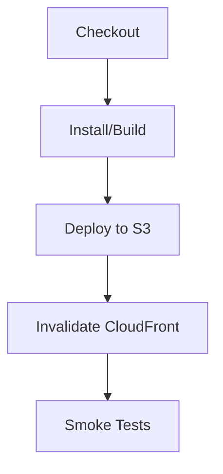
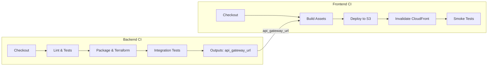

# HybridMulti Cloud Resume API

**Live Site:** [https://hybridmulti.cloud](https://hybridmulti.cloud)

---

## 🎯 Resume API Unified Overview
This document provides a consolidated view of the Resume API architecture, covering both the **resume-api-backend** and **resume-api-frontend** repositories, their CI/CD workflows, cross‑repo dependencies, and visualization strategies.

---

## 📂 Repository Structure & Responsibilities
| Repository               | Purpose                                 | Key Technologies                                   |
|--------------------------|-----------------------------------------|----------------------------------------------------|
| **resume-api-backend**   | REST API for resume data                | Python, AWS Lambda, API Gateway, DynamoDB, Terraform |
| **resume-api-frontend**  | Static web UI to interact with the API  | HTML, CSS, JavaScript, S3, CloudFront, npm tooling (optional) |

---

## 1. Backend Workflow (resume-api-backend)

### 1.1 Pipeline Triggers
- **push** to `main`
- **pull_request** targeting `main`

### 1.2 CI/CD Steps
1. Checkout source code
2. Setup Python environment
3. Lint & format with Black & Flake8
4. Run unit tests (pytest + moto)
5. Package Lambda artifact into `lambda_function.zip`
6. Terraform:
   - `init`, `validate`, `plan`
   - `apply` (outputs: `api_gateway_url`, `lambda_arn`, `dynamodb_table_name`)
7. Integration tests against deployed API
8. Publish outputs (GitHub Actions outputs or SSM)



---

## 2. Frontend Workflow (resume-api-frontend)

### 2.1 Pipeline Triggers
- **push** to `main`
- **pull_request** targeting `main`

### 2.2 CI/CD Steps
1. Checkout source code
2. *(Optional)* `npm ci` & `npm run build` for asset bundling
3. Sync built assets to S3 (`aws s3 sync`)
4. Invalidate CloudFront distribution (`aws cloudfront create-invalidation`)
5. Smoke tests: fetch homepage, verify HTTP 200 & presence of API URL



---

## 3. Cross-Repository Orchestration

### 3.1 Output → Input Mapping
| Backend Output         | Storage Location                                      | Frontend Input                                     |
|------------------------|-------------------------------------------------------|----------------------------------------------------|
| `api_gateway_url`      | GitHub Actions output or AWS SSM Parameter Store      | Injected into `index.tmpl.html` or JS at build time |

### 3.2 Combined CI/CD Mermaid Diagram


---

## 📈 Combined Architecture (Mermaid Diagram)
```mermaid
flowchart LR
  %% Source trigger
  GH[GitHub Actions]

  %% CI/CD orchestration
  subgraph CI/CD Workflows
    GH -->|infra.yml, lambda-deploy.yml, frontend.yml, monitoring.yml| TF[Terraform]
  end

  %% AWS Infrastructure
  subgraph AWS Infrastructure
    direction LR
    TF --> APIGW[API Gateway]
    TF --> S3[S3 (Static Site)]

    subgraph Compute
      APIGW --> Lambda[AWS Lambda]
      Lambda --> DynamoDB[DynamoDB]
      Lambda --> CW[CloudWatch]
    end

    subgraph CDN & DNS
      S3 --> CF[CloudFront CDN]
      CF --> Route53[Route 53 DNS]
      Route53 --> IU[Internet Users]
    end
  end

  %% Optional: show how dynamic data might flow through CDN
  DynamoDB -.->|cached responses| CF
  IU -->|requests static & dynamic| CF
``` 

---

## 🚀 Getting Started

1. **Clone the repo**
   ```bash
   git clone https://github.com/hybridmulticloud/cloud-challenge.git
   cd cloud-challenge
   ```

2. **Prepare Terraform remote state**
   - Configure an S3 bucket and DynamoDB table for locking in `infra/backend.tf`.
   - Initialize Terraform:
     ```bash
     terraform init        -backend-config="bucket=your-bucket"        -backend-config="dynamodb_table=your-lock-table"        -backend-config="region=eu-west-1"
     ```

3. **Deploy Infrastructure**
   - **Backend** (API):
     ```bash
     cd backend/terraform
     terraform apply -var="env=dev"
     ```
   - **Frontend** (Website):
     ```bash
     cd ../frontend/terraform
     terraform apply -var="env=dev"
     ```

4. **Run Locally** (optional)
   - **Backend**:
     ```bash
     pip install -r backend/requirements.txt
     AWS_PROFILE=your-profile python backend/lambda_function.py
     ```
   - **Frontend**: open `frontend/index.html` in your browser.

---

## 🔧 Infrastructure Overview

- **Providers**: AWS (eu-west-1 primary, us-east-1 for ACM)
- **Services**:
  - S3 + CloudFront (static hosting)
  - API Gateway (REST)
  - Lambda (Python 3.9)
  - DynamoDB (NoSQL resume store)
  - CloudWatch (logs & alarms)
- **CI/CD**: GitHub Actions for Terraform, Lambda, and frontend deployments.

---

## ⚙️ GitHub Actions CI/CD

Both repositories use GitHub Actions to automate deployment:
- **Backend**:
  - Terraform infrastructure (`infra.yml`)
  - Lambda deployment (`lambda-deploy.yml`)
  - Artifact outputs (`api-url`, `cloudfront-id`)
- **Frontend**:
  - Uses backend outputs
  - Injects URL into `index.tmpl.html`
  - Syncs to S3
  - Invalidates CloudFront cache
- **Monitoring**:
  - Deploys CloudWatch alarms & Synthetics canaries

---

## Why This Matters

This project demonstrates:
- Practical cloud skills (IAM, API Gateway, Lambda, S3, CloudFront, DynamoDB)
- Professional DevOps patterns (CI/CD pipelines, IaC, GitOps)
- Clear documentation and ownership — easy for teams or hiring managers to understand and extend

---

## 📄 License

This project is licensed under the MIT License. See [LICENSE](LICENSE) for details.
