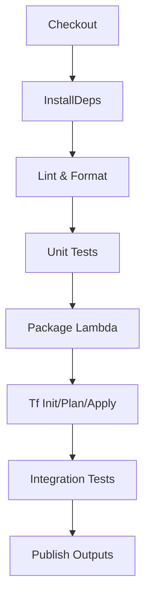
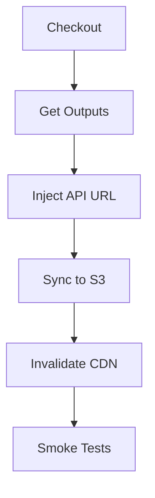
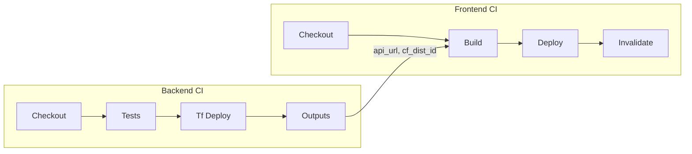
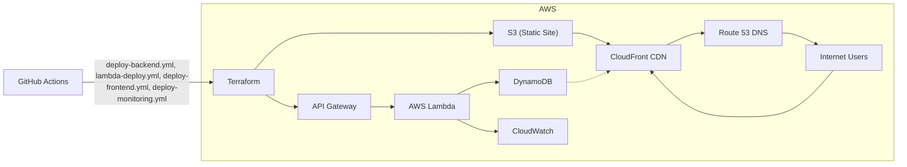

# HybridMulti Cloud Resume API

**Live Site:** [https://hybridmulti.cloud](https://hybridmulti.cloud)

---

## 🎯 Resume API Unified Overview
This document provides a consolidated view of the full-stack Resume API solution, covering both the **resume-api-backend** and **resume-api-frontend** repositories, their CI/CD workflows, cross-repo dependencies, and end-to-end architecture.

---

## 📂 Repository Structure & Responsibilities
| Repository               | Purpose                                 | Key Technologies                                   |
|--------------------------|-----------------------------------------|----------------------------------------------------|
| **resume-api-backend**   | REST API for resume data                | Python, AWS Lambda, API Gateway, DynamoDB, Terraform |
| **resume-api-frontend**  | Static website UI for the API           | HTML, CSS, JavaScript, S3, CloudFront, GitHub Actions |

---

## 1. Backend Workflow (`resume-api-backend`)

### 1.1 Folder Layout
```
resume-api-backend/
├── lambda_function.py      # Lambda handler
├── requirements.txt        # Python dependencies
├── terraform/              # Infrastructure code
│   ├── main.tf             # Resource definitions (DynamoDB, API Gateway, IAM)
│   ├── variables.tf        # Input variables
│   └── outputs.tf          # Outputs (api_gateway_url, lambda_arn, table_name)
└── tests/                  # Unit & integration tests (pytest + moto)
```

### 1.2 Pipeline Triggers
- **push** to `main`
- **pull_request** targeting `main`

### 1.3 CI/CD Steps
1. Checkout source code
2. Setup Python environment and install dependencies
3. Lint & format with Black and Flake8
4. Run unit tests (pytest + moto)
5. Package Lambda into `lambda_function.zip`
6. Terraform tasks:
   - `terraform init`, `validate`, `plan`
   - `terraform apply` (outputs: `api_gateway_url`, `lambda_arn`, `dynamodb_table_name`)
7. Execute integration tests against deployed API
8. Publish outputs (`api_url`, `cf_dist_id`) as GitHub Actions outputs



### 1.4 Components
- **Terraform** defines:
  - DynamoDB table **VisitorCount**
  - HTTP API (API Gateway v2) with `/UpdateVisitorCount`
  - IAM roles/policies for Lambda and API Gateway
- **Lambda** (`lambda_function.py`):
  - Reads/increments a counter in **VisitorCount**
  - Returns JSON `{ "visits": <count> }`
- **GitHub Actions**:
  - `deploy-backend.yml`: Terraform infra
  - `lambda-deploy.yml`: Build and deploy Lambda
  - `deploy-monitoring.yml`: Terraform monitoring (CloudWatch, Synthetics)

---

## 2. Frontend Workflow (`resume-api-frontend`)

### 2.1 Folder Layout
```
resume-api-frontend/
├── public/                          # Generated static site
│   ├── index.html                   # Final HTML
│   └── assets/                      # CSS, JS, images
├── index.tmpl.html                  # HTML template with ${API_URL}
├── style.css                        # Stylesheet
└── terraform/                       # Infra code for S3, CloudFront, Route53
    ├── frontend_infra.tf            # Main Terraform config (bucket, CDN, DNS)
    ├── variables.tf                 # Variables: bucket_name, domain_name, cert_arn, price_class
    ├── outputs.tf                   # Outputs: bucket_name, cf_dist_id, cf_domain_name, oai_id
    └── versions.tf                  # Terraform required providers and versions
```

### 2.2 Pipeline Triggers
- **push** to `main`
- **pull_request** targeting `main`

### 2.3 CI/CD Steps
1. Checkout source code
2. Download infra outputs (`api_url`, `cf_dist_id`)
3. Inject `${API_URL}` into `index.tmpl.html` → `public/index.html`
4. Sync `public/` to S3 (`aws s3 sync`)
5. Invalidate CloudFront (`aws cloudfront create-invalidation`)
6. Smoke tests: GET homepage returns HTTP 200 and correct visitor count



### 2.4 Components
- **Template Injection**: fills `public/index.html` with live API endpoint
- **Static Hosting**: S3 bucket (website), CloudFront CDN for HTTPS
- **GitHub Actions**:
  - `deploy-frontend.yml`: Build, upload, invalidate cache

### 2.5 Frontend Terraform Components
- **Origin Access Identity**: `aws_cloudfront_origin_access_identity.oai`
  - Restricts S3 bucket access to CloudFront only.
- **S3 Bucket**: `aws_s3_bucket.resume_site`
  - **Website hosting** enabled with `index.html` and `error.html` fallback.
  - **Versioning** enabled.
  - **Server-side encryption** (SSE-S3).
  - **Block public access** and grant access via OAI.
- **Bucket Policy**: `aws_s3_bucket_policy.resume_site_policy`
  - Allows `GetObject` to CloudFront OAI on `arn:aws:s3:::${bucket}/*`.
- **Logging Bucket**: `aws_s3_bucket.logging_bucket`
  - Stores access logs for the CloudFront distribution.
- **CloudFront Distribution**: `aws_cloudfront_distribution.resume_cdn`
  - **Origins**:
    - Primary: S3 Website endpoint (`resume_site`).
    - Logging bucket for access logs.
  - **Default root object**: `index.html`.
  - **Viewer protocol policy**: Redirect HTTP to HTTPS.
  - **Allowed methods**: GET, HEAD, OPTIONS.
  - **Cache behaviors**:
    - Default behavior caches `index.html` and assets with TTLs.
  - **Custom error responses**:
    - 404/403: Serve `/index.html` and HTTP 200.
  - **Logging**: Enabled, logs delivered to `logging_bucket` prefix.
  - **Price class**: `PriceClass_100` (North America, Europe, Asia).
  - **Viewer certificate**: ACM certificate in `us-east-1` for HTTPS.
- **Route53 Record**: `aws_route53_record.resume_dns`
  - **Alias** record for apex and `www` subdomain pointing to CloudFront.
- **Variables & Outputs**:
  - `terraform/variables.tf`:
    - `bucket_name`, `domain_name`, `certificate_arn`, `price_class`.
  - `terraform/outputs.tf`:
    - `bucket_name`, `cf_distribution_id`, `cf_domain_name`, `oai_id`.

---

## 3. Cross-Repo Orchestration

| Backend Output       | Storage Location                   | Frontend Input                           |
|----------------------|------------------------------------|------------------------------------------|
| `api_gateway_url`    | GitHub Actions outputs             | Inject into frontend template           |
| `cf_dist_id`         | GitHub Actions outputs             | CloudFront invalidation step            |



---

## 📈 Full Architecture (Mermaid)


---

## 🚀 Getting Started
```bash
git clone https://github.com/hybridmulticloud/cloud-challenge.git
cd cloud-challenge
# Backend Infra
terraform init \
  -backend-config="bucket=<your-bucket>" \
  -backend-config="dynamodb_table=<your-lock-table>"
terraform apply -var="env=dev" -chdir=resume-api-backend/terraform
# Frontend Infra
terraform apply -var="env=dev" -chdir=resume-api-frontend/terraform
``` 

---

## 📄 License
MIT License. See [LICENSE](LICENSE).
