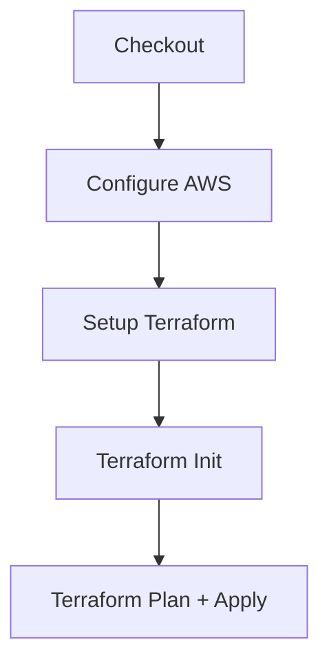
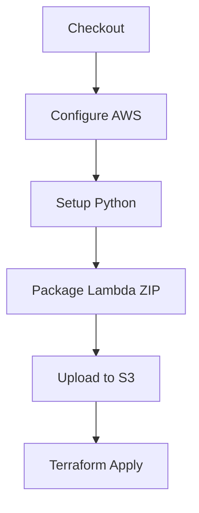
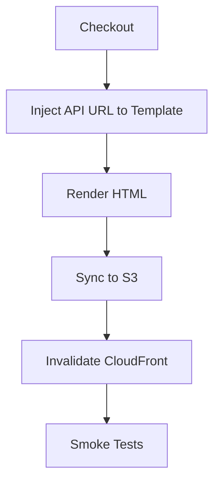
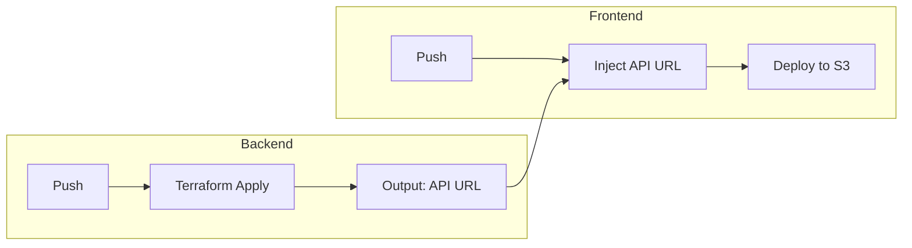
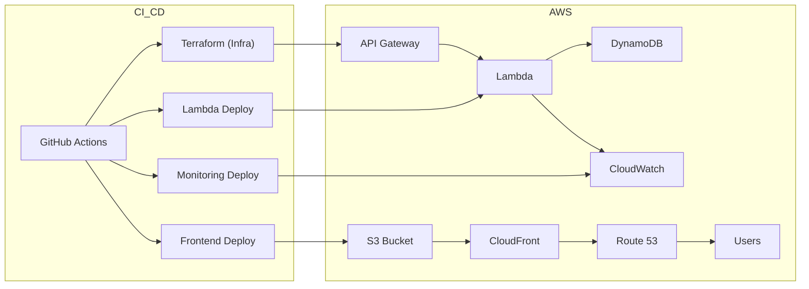

# 🌐 HybridMulti.Cloud - Resume API Project

**Live Site:** [https://hybridmulti.cloud](https://hybridmulti.cloud)

---

## 🎯 Project Overview

This project is a full-stack cloud-native resume viewer that exposes a serverless REST API to track profile views and hosts a static website frontend. It's built with AWS and managed using Infrastructure as Code (Terraform).

---

## 🧠 Key Technologies

| Component      | Stack                                                                 |
|----------------|-----------------------------------------------------------------------|
| Backend        | Python, AWS Lambda, API Gateway, DynamoDB, Terraform, GitHub Actions |
| Frontend       | HTML, CSS, JavaScript, AWS S3, CloudFront, GitHub Actions            |
| Infrastructure | Terraform, AWS IAM, S3, API Gateway, Lambda, DynamoDB                |
| Monitoring     | CloudWatch, GitHub Actions                                            |

---

## 📁 Repository Structure

### `resume-api-backend`
- `src/lambda_function.py`: core API logic (view counter)
- `infra/*.tf`: Terraform for Lambda, API Gateway, DynamoDB
- `.github/workflows/`: CI/CD pipelines

### `resume-api-frontend`
- `public/index.tmpl.html`: dynamic HTML with injected API URL
- `.github/workflows/`: deploy to S3 + invalidate CloudFront

---

## 🚀 How to Deploy

```bash
# Backend
cd resume-api-backend/infra
terraform init && terraform apply

# Frontend (manual)
cd resume-api-frontend/public
aws s3 sync . s3://<bucket-name> --delete
```

---

## 🔐 Environment Variables

In GitHub Actions or local:
- `AWS_ACCESS_KEY_ID`
- `AWS_SECRET_ACCESS_KEY`
- `AWS_REGION`

---

## 🧪 CI/CD Summary

- Backend deploys via Terraform + Lambda ZIP upload
- Frontend pushes to S3 with CDN invalidation
- Cross-repo: API URL output → injected into frontend template

---


## 🗺️ High-Level Architecture

```mermaid
flowchart TD
  User[Browser] --> CF[CloudFront CDN]
  CF --> S3[Static Website (S3)]
  CF --> API[API Gateway]
  API --> Lambda[AWS Lambda]
  Lambda --> DB[DynamoDB]
```

---

## 🔁 Backend Infra CI/CD Workflow



---

## 🔁 Lambda CI/CD Workflow



---

## 🔁 Frontend CI/CD Workflow



---

## 🔄 Cross-Repository CI/CD



---

## 🧱 Full Infrastructure Map



---

## 🙋‍♂️ Author & Contribution

This project was fully designed and implemented by Kerem Kirci, a Senior Technical Consultant focused on hybrid/multi-cloud automation. It showcases:

- Serverless API design with AWS Lambda
- Full Infrastructure as Code with Terraform
- CI/CD pipelines with GitHub Actions
- Frontend templating and static site delivery via CloudFront

[LinkedIn](https://linkedin.com/in/kerem-kirci) | [GitHub](https://github.com/hybridmulticloud)

---
